# 🧠 Pipeline de Engenharia de Dados – Mercado de Notebooks KaBuM


---

## Visão Geral

Este projeto implementa um **pipeline completo de Engenharia de Dados** de ponta a ponta, coletando dados de notebooks do site da KaBuM e transformando-os em insights analíticos prontos para consumo de BI.

O pipeline cobre todas as fases: coleta via Web Scraping em Python, ingestão em Azure Data Lake Storage Gen2 (ADLS), processamento distribuído com PySpark no Databricks, governança via Unity Catalog, armazenamento em Delta Lake com versionamento e ACID, e visualização no Tableau.

**Stack Técnica:**

| Camada | Tecnologia |
|---|---|
| Coleta | Python 3.10, requests, BeautifulSoup4 |
| Storage | Azure Blob Storage / ADLS Gen2 |
| Processamento | Databricks (PySpark), Delta Lake |
| Governança | Unity Catalog |
| Orquestração | Databricks Jobs (agendamento) |
| Visualização | Tableau Desktop/Online |

---

## Arquitetura

O pipeline segue o padrão **Medallion Architecture**, garantindo separação clara de responsabilidades entre camadas, rastreabilidade total e reprodutibilidade do pipeline.

```
Bronze → Silver → Gold
```

| Camada | Propósito | Formato |
|---|---|---|
| Bronze | Raw data — dado bruto sem transformação, preservado para auditoria | Delta Lake (JSONL → Delta) |
| Silver | Limpeza, deduplicação, type casting, padronização | Delta Lake (particionado) |
| Gold | Feature engineering, scoring de qualidade, dataset analítico final | Delta Lake (Unity Catalog) |

---

## Diagrama de Arquitetura

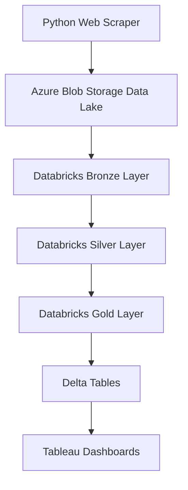

---

## Infraestrutura Azure

O projeto utiliza **Azure Data Lake Storage Gen2** com três containers dedicados às camadas Medallion, garantindo isolamento de dados por camada e controle granular de custo por tier de armazenamento.

📸 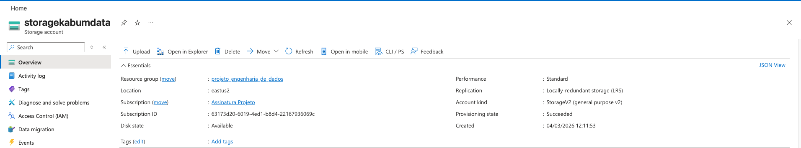

📸 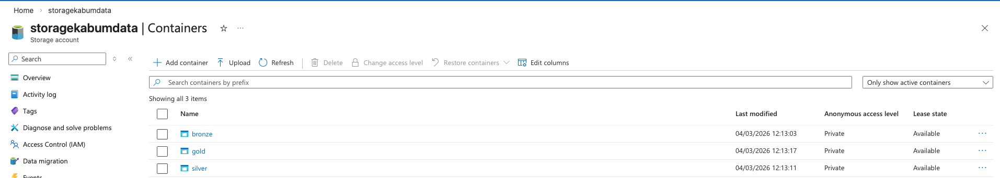

📸 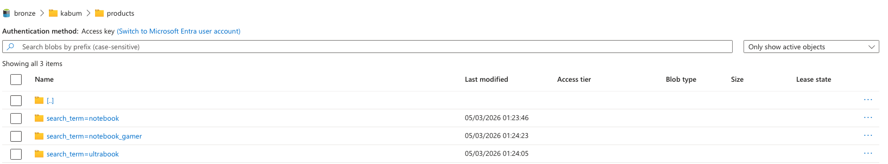

### Paths ABFSS por Camada

```
# Bronze
abfss://bronze@storagekabumdata.dfs.core.windows.net/inbox/kabum/bronze_scrape_v1/
abfss://bronze@storagekabumdata.dfs.core.windows.net/kabum/bronze/products_delta

# Silver
abfss://silver@storagekabumdata.dfs.core.windows.net/kabum/products_clean

# Gold
abfss://gold@storagekabumdata.dfs.core.windows.net/inbox/kabum/gold_enrichment_v1/
```

### Otimização de Custo em Nuvem

A arquitetura foi desenhada com foco em eficiência de custos no Azure:

**Particionamento Dinâmico:**  
A Silver Layer é particionada por `ingestion_date` e `search_term`, permitindo sobrescrita dinâmica de partições específicas sem reprocessar todo o dataset. Isso reduz drasticamente o custo de computação em pipelines incrementais.

```python
spark.conf.set("spark.sql.sources.partitionOverwriteMode", "dynamic")

df_silver_final.write
    .format("delta")
    .mode("overwrite")
    .partitionBy("ingestion_date", "search_term")
    .saveAsTable(SILVER_TABLE)
```

**Delta Lake com ACID e Time Travel:**  
O uso de Delta Lake elimina a necessidade de reprocessar dados históricos completos. O mecanismo de `MERGE` na tabela de qualidade diária (`catalog_quality_daily`) atualiza apenas partições alteradas, evitando overwrites totais custosos.

**Schema Evolution controlada:**  
A opção `mergeSchema=true` é usada seletivamente apenas nas camadas Gold, onde a evolução de schema é esperada. Na Bronze, `overwriteSchema=true` é isolado, evitando drift acidental de schema nas camadas mais críticas.

**Infraestrutura de Cluster:**  
O job Databricks é configurado para terminar automaticamente após execução, eliminando custos de cluster idle. Configuração recomendada: cluster single-node ou multi-worker apenas durante o job agendado.

---

## Configuração Central — Unity Catalog

O notebook `00_config_uc` centraliza todos os parâmetros de catálogo, schema e paths, sendo invocado via `%run` nos demais notebooks. Isso garante consistência e facilita mudanças de ambiente (dev → prod) em um único arquivo.

📓 [00_config_uc.ipynb](notebooks/00_config_uc.ipynb)

```python
# Unity Catalog
CATALOG = "projeto_data_engineering"
SCHEMA  = "kabum_project"

spark.sql(f"USE CATALOG {CATALOG}")
spark.sql(f"CREATE SCHEMA IF NOT EXISTS {SCHEMA}")
spark.sql(f"USE SCHEMA {SCHEMA}")

# Storage Account
STORAGE_ACCOUNT = "storagekabumdata"

BRONZE_ABFSS = f"abfss://bronze@{STORAGE_ACCOUNT}.dfs.core.windows.net/"
SILVER_ABFSS = f"abfss://silver@{STORAGE_ACCOUNT}.dfs.core.windows.net/"
GOLD_ABFSS   = f"abfss://gold@{STORAGE_ACCOUNT}.dfs.core.windows.net/"

# Tabelas UC
BRONZE_TABLE        = f"{CATALOG}.{SCHEMA}.products_bronze"
SILVER_TABLE        = f"{CATALOG}.{SCHEMA}.products_clean"
GOLD_ENRICHED_TABLE = f"{CATALOG}.{SCHEMA}.products_enriched"
SCORED_TABLE        = f"{CATALOG}.{SCHEMA}.products_scored"
QUALITY_TABLE       = f"{CATALOG}.{SCHEMA}.quality_daily"

# Partitioned overwrite global
spark.conf.set("spark.sql.sources.partitionOverwriteMode", "dynamic")
```

---

## Web Scraping

Os dados são coletados diretamente do site da KaBuM em dois estágios: coleta principal (Bronze) e enriquecimento técnico (Gold inbox).

**Bibliotecas:**
- `requests` — requisições HTTP com controle de User-Agent
- `BeautifulSoup4` — parsing de HTML
- `azure-storage-blob` — upload direto para ADLS via SDK Python
- `pandas`, `tqdm` — manipulação e progresso

**Estratégias técnicas do scraper:**
- User-Agent customizado (Safari/macOS) para evitar bloqueios
- `time.sleep(random)` entre requisições para rate limiting
- Upload direto para Azure Blob Storage via `BlobServiceClient`
- Detecção automática do arquivo CSV mais recente no prefix ADLS (`_pick_csv_in_prefix`)
- Fallback de colunas de preço: tenta múltiplos campos (`price`, `price_text`, `price_str`, `price_formatted`) antes de retornar NULL

```python
def scrape_product(url):
    r = requests.get(url)
    soup = BeautifulSoup(r.text, "html.parser")

    name = soup.find("h1").text
    price = soup.find("span").text

    return {
        "product_name": name,
        "price": price
    }
```

📄 [scraper/kabum_scrape_v2.py](scraper/kabum_scrape_v2.py)
📄 [scraper/run_local.py](scraper/run_local.py)

📸 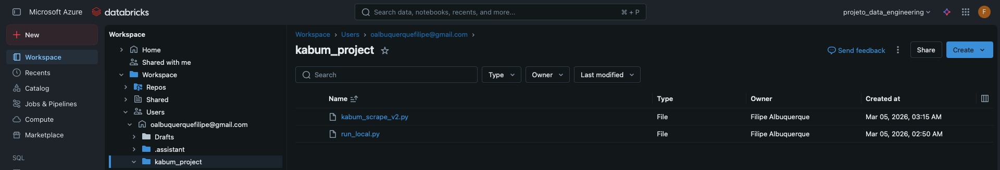

---

## Camadas do Data Lake

### Bronze — Ingestão de Dados Brutos

Armazena **dados brutos coletados pelo scraper sem transformações**. A camada Bronze é imutável do ponto de vista analítico — seu objetivo é preservar o payload original para auditoria e reprocessamento.

**Características técnicas:**
- Leitura de JSONL via `spark.read.format("json")` com suporte a schema inference
- Captura de metadados de origem via `_metadata.file_path` (rastreabilidade de arquivo fonte)
- Adição automática de `ingestion_date` via `F.current_date()`
- Validação de colunas críticas antes da escrita (`marketplace`, `search_term`, `product_url`, `product_name`, `price`, `brand`)
- Registro de tabela no Unity Catalog via DDL `CREATE TABLE ... USING DELTA LOCATION ...`

```python
df_bronze = (
    spark.read
         .format("json")
         .load(BRONZE_SOURCE_PATH)
         .withColumn("_src_file", F.expr("_metadata.file_path"))
         .withColumn("ingestion_date", F.current_date())
)

# Gravar Delta
df_bronze.write
    .format("delta")
    .mode("overwrite")
    .option("overwriteSchema", "true")
    .save(BRONZE_DELTA_PATH)
```

**Registro no Unity Catalog:**
```sql
CREATE TABLE IF NOT EXISTS projeto_data_engineering.kabum_project.products_bronze
USING DELTA
LOCATION 'abfss://bronze@storagekabumdata.dfs.core.windows.net/kabum/bronze/products_delta'
```

Notebook responsável:

📓 [01_bronze_kabum_uc_adls_jsonl.ipynb](notebooks/01_bronze_kabum_uc_adls_jsonl.ipynb)

📸 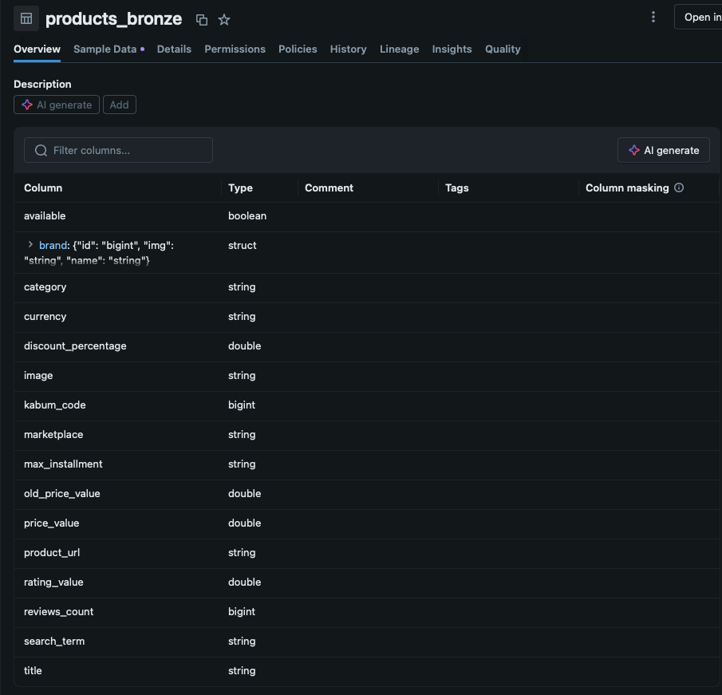

---

### Silver — Limpeza e Padronização

Executa **limpeza, deduplicação e padronização do dataset**. É a camada mais crítica para a qualidade dos dados — falhas aqui impactam diretamente os dashboards e o scoring Gold.

**Transformações aplicadas:**

- **Parsing de preço BRL:** regex robusto que normaliza strings como `"R$ 3.499,90"`, `"À vista R$ 2.999"`, `"no PIX R$ 2.500,00"` para `double`
- **Normalização de marca:** parsing de JSON aninhado da coluna `brand` (que pode ser struct, JSON string, ou plain string)
- **Deduplicação via Window:** `ROW_NUMBER()` particionado por `(product_key, ingestion_date, search_term)` ordenado por `scraped_at DESC`, garantindo apenas o registro mais recente por chave
- **Geração de `product_key`:** SHA-256 sobre `product_url` (ou fallback `product_name || brand`) garantindo chave determinística e idempotente
- **Validação de `old_price`:** descartado quando `old_price <= price` (dado inválido), calculando `discount_pct` apenas com desconto real
- **Compatibilidade de schema:** função `col_if_exists()` garante que colunas ausentes retornem `NULL` em vez de quebrar o job

```python
def parse_brl_price(col_):
    s = F.trim(col_.cast('string'))
    s = F.regexp_replace(s, r"(?i)\b(de|por|à vista|pix|no pix|cart[aã]o|no cart[aã]o)\b[:\s]*", '')
    s = F.regexp_replace(s, r"(?i)r\$\s*", '')
    s = F.regexp_replace(s, r"\s+", '')
    s = F.regexp_replace(s, r"[^0-9\.,]", '')
    s = F.regexp_replace(s, r"\.(?=\d{3}(\D|$))", '')
    s = F.regexp_replace(s, ',', '.')
    return s.cast('double')
```

**Particionamento da tabela Silver:**
```python
df_silver_final.write
    .format("delta")
    .mode("overwrite")
    .partitionBy("ingestion_date", "search_term")
    .saveAsTable("projeto_data_engineering.kabum_project.products_clean")
```

Notebook responsável:

📓 [02_silver_transform_uc.ipynb](02_silver_transform_uc.ipynb)

📸 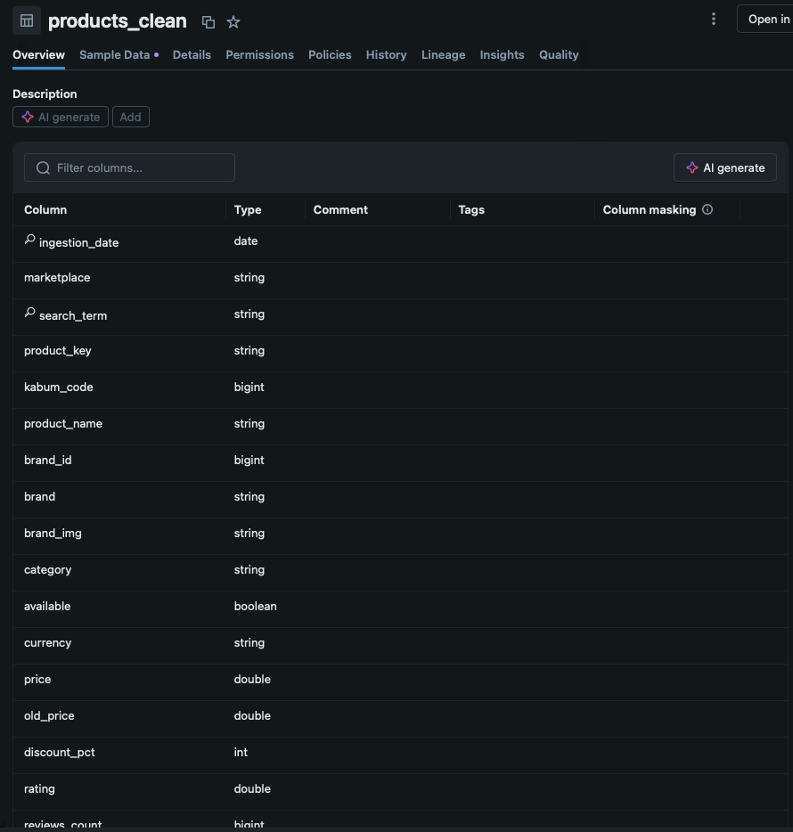

---

### Gold — Feature Engineering e Analytics

Produz **datasets analíticos prontos para BI**, enriquecendo os dados Silver com atributos técnicos extraídos via regex e dados de um segundo scrape de enriquecimento (CSV).

**Fluxo Gold:**

1. **Enriquecimento (`03_gold_enrichment_uc`):** Lê CSV de enriquecimento do ADLS Gold inbox, registra como `enrichment_raw`, faz join com `products_clean` e grava `notebooks_features_enriched`
2. **Scoring e Qualidade (`04_gold_scoring_quality_uc`):** Calcula completude por linha e grava `notebooks_features_scored` + `catalog_quality_daily`
3. **KPIs SQL (`05_dashboard_sql_kpis_uc`):** Views e queries SQL para consumo direto pelo Tableau

**Feature engineering por regex:**
```python
ram_gb = F.regexp_extract(F.col("product_name"), r"(\d+)GB RAM", 1)
```

**Scoring de completude de catálogo:**
```python
candidate_fields = [
    "ram_gb", "storage_total_gb", "screen_inches", "cpu_model", "cpu_series", "cpu_gen",
    "gpu_model", "screen_resolution_std", "panel_type_std", "refresh_rate_hz",
    "price", "original_price", "discount_pct", "brand"
]

filled = sum(F.when(F.col(c).isNotNull(), F.lit(1)).otherwise(F.lit(0)) for c in fields)

df_scored = (
    df
    .withColumn("catalog_fields_total", F.lit(len(fields)))
    .withColumn("catalog_fields_filled", filled)
    .withColumn("catalog_completeness_pct",
        F.round(F.col("catalog_fields_filled") / F.col("catalog_fields_total") * 100, 2))
    .withColumn("catalog_completeness_tier",
        F.when(F.col("catalog_completeness_pct") >= 80, F.lit("HIGH"))
         .when(F.col("catalog_completeness_pct") >= 50, F.lit("MEDIUM"))
         .otherwise(F.lit("LOW")))
)
```

**Atualização incremental da tabela de qualidade com Delta MERGE:**
```python
tgt.alias("t")
    .merge(df_q.alias("s"), condition)
    .whenMatchedUpdateAll()
    .whenNotMatchedInsertAll()
    .execute()
```

Tabela final analítica: `projeto_data_engineering.kabum_project.notebooks_features_scored`

Notebooks responsáveis:

📓 [03_gold_enrichment_uc.ipynb](03_gold_enrichment_uc.ipynb)
📓 [04_gold_scoring_quality_uc.ipynb](04_gold_scoring_quality_uc.ipynb)
📓 [05_dashboard_sql_kpis_uc.ipynb](05_dashboard_sql_kpis_uc.ipynb)

📸 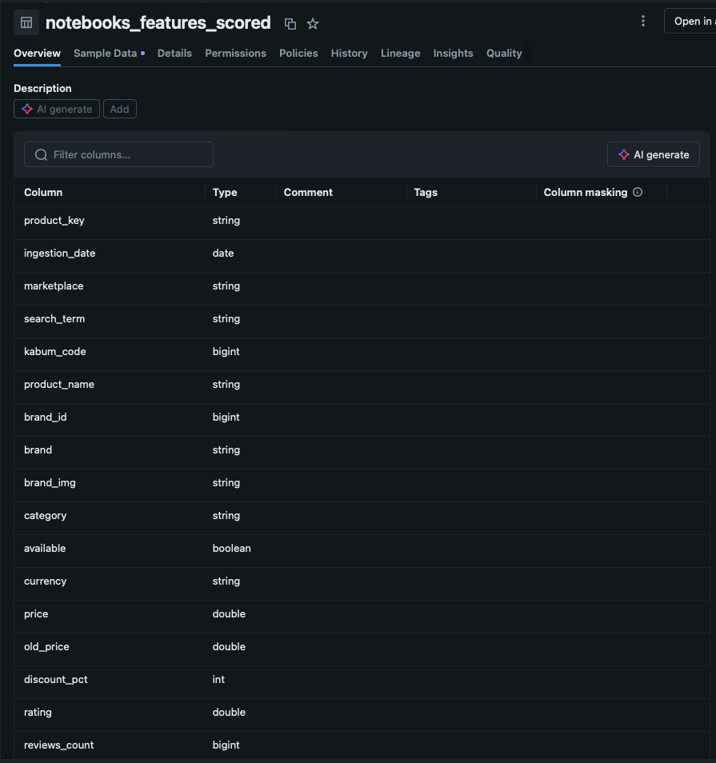

---

## Databricks — Notebooks e Jobs

📸 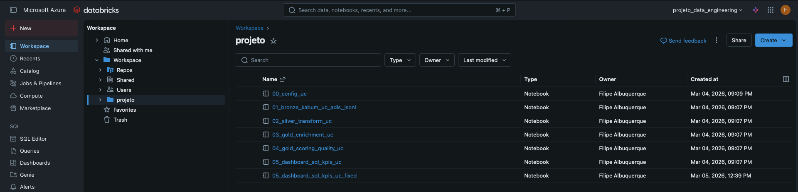

📸 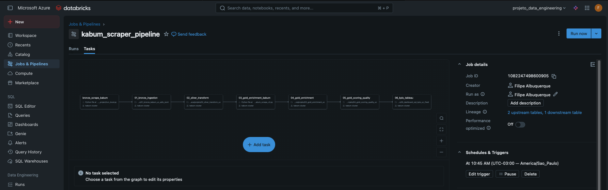

---

## Dashboards

Dois dashboards foram criados no Tableau conectados diretamente às tabelas Gold do Unity Catalog via conector Databricks SQL.

**Market Overview** — Análise de mercado: distribuição de preços por marca, faixas de desconto, ranking de produtos e comparativo de segmentos.

📸 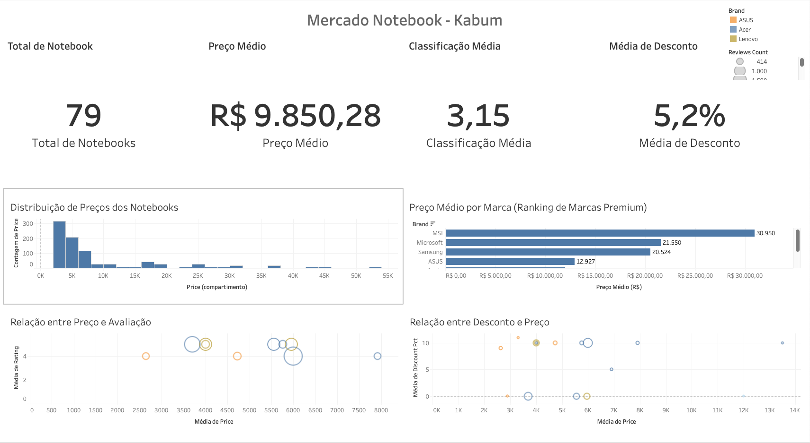

**Monitoramento de Qualidade de Dados** — KPIs de completude do catálogo: `catalog_completeness_pct` por `search_term`, distribuição de tiers (HIGH / MEDIUM / LOW), evolução temporal da qualidade por `ingestion_date`.

📸 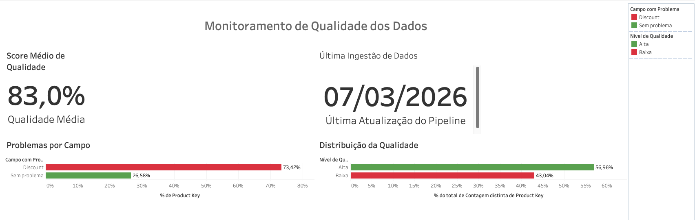

---

## Delta Lake — Tabelas Analíticas

📸 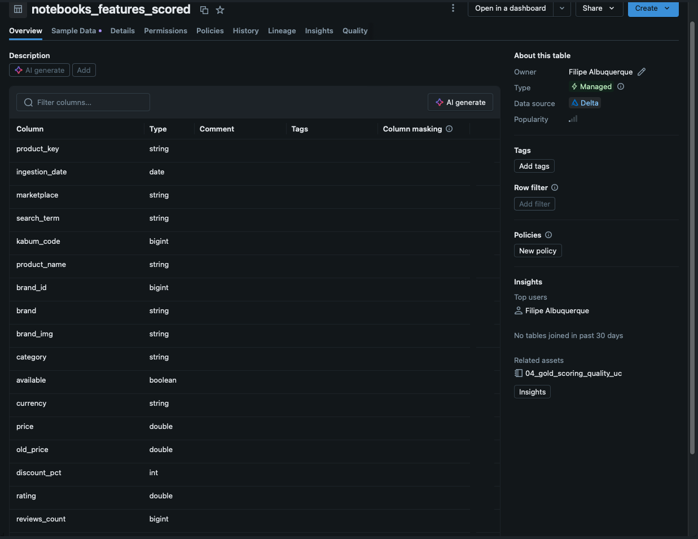

---

## Estrutura de Tabelas — Unity Catalog

```
projeto_data_engineering
└── kabum_project
    ├── products_bronze             ← Bronze raw Delta
    ├── products_clean              ← Silver limpo, particionado
    ├── enrichment_raw              ← CSV de enriquecimento (staging)
    ├── notebooks_features_enriched ← Gold join Silver + enrich
    ├── notebooks_features_scored   ← Gold final com scoring
    └── catalog_quality_daily       ← Qualidade diária (MERGE incremental)
```

---

## Dicionário de Dados

### `products_bronze` — Camada Bronze

| Coluna | Tipo | Descrição |
|---|---|---|
| marketplace | string | Origem do dado (ex: kabum) |
| search_term | string | Termo de busca utilizado no scrape |
| product_url | string | URL do produto no marketplace |
| product_name | string | Nome completo do produto conforme site |
| brand | string / struct | Marca (raw — pode ser JSON aninhado) |
| price | string | Preço bruto conforme capturado (sem parsing) |
| ingestion_date | date | Data de ingestão do arquivo |
| _src_file | string | Path ABFSS do arquivo JSONL de origem |

---

### `products_clean` — Camada Silver

Particionada por: `ingestion_date`, `search_term`

| Coluna | Tipo | Descrição |
|---|---|---|
| ingestion_date | date | Data de ingestão — chave de partição |
| marketplace | string | Origem do dado |
| search_term | string | Termo de busca — chave de partição |
| product_key | string | SHA-256 de `product_url` ou `product_name\|\|brand` — chave surrogate |
| kabum_code | bigint | Código interno KaBuM |
| product_name | string | Nome do produto normalizado |
| brand_id | bigint | ID numérico da marca |
| brand | string | Nome da marca normalizado (upper case, sem caracteres especiais) |
| brand_img | string | URL da imagem da marca |
| category | string | Categoria do produto |
| available | boolean | Disponibilidade em estoque |
| currency | string | Moeda (BRL) |
| price | double | Preço atual em BRL (após parsing de string) |
| old_price | double | Preço anterior (validado: apenas quando > price) |
| discount_pct | int | Percentual de desconto calculado: `round((old_price - price) / old_price * 100)` |
| discount_pct_site | double | Desconto declarado pelo site |
| discount_pct_gap | double | Diferença entre desconto do site e desconto calculado |
| rating | double | Avaliação média (0–5) |
| reviews_count | bigint | Número de avaliações |
| max_installment | string | Parcelamento máximo disponível |
| product_url | string | URL canônica (query string e fragmentos removidos) |
| image_url | string | URL da imagem do produto |
| scraped_at | timestamp | Timestamp da coleta |
| price_raw | string | Preço original bruto antes do parsing |
| old_price_raw | string | Preço anterior original bruto |
| discount_pct_raw | string | Desconto bruto conforme site |

---

### `notebooks_features_scored` — Camada Gold (Tabela Final Analítica)

| Coluna | Tipo | Descrição |
|---|---|---|
| product_key | string | Chave surrogate SHA-256 |
| ingestion_date | date | Data de ingestão |
| marketplace | string | Origem do dado |
| search_term | string | Termo de busca |
| product_name | string | Nome do produto |
| brand | string | Marca |
| price | double | Preço atual |
| old_price | double | Preço anterior |
| discount_pct | int | Percentual de desconto calculado |
| rating | double | Avaliação média |
| reviews_count | bigint | Número de avaliações |
| ram_gb | int | RAM extraída por regex do nome do produto |
| storage_total_gb | int | Armazenamento total extraído |
| screen_inches | double | Tamanho de tela extraído |
| cpu_model | string | Modelo do processador |
| cpu_series | string | Série do processador |
| cpu_gen | string | Geração do processador |
| gpu_model | string | Modelo da GPU |
| screen_resolution_std | string | Resolução padronizada (ex: Full HD, 4K) |
| panel_type_std | string | Tipo de painel padronizado (IPS, TN, OLED etc.) |
| refresh_rate_hz | int | Taxa de atualização em Hz |
| catalog_fields_total | int | Total de campos avaliados no scoring |
| catalog_fields_filled | int | Quantidade de campos preenchidos |
| catalog_completeness_pct | double | Percentual de completude do catálogo (0–100) |
| catalog_completeness_score | int | Score absoluto de completude |
| catalog_completeness_tier | string | Tier de qualidade: HIGH (≥80%), MEDIUM (≥50%), LOW (<50%) |

---

### `catalog_quality_daily` — Qualidade Diária (MERGE incremental)

| Coluna | Tipo | Descrição |
|---|---|---|
| ingestion_date | date | Data de referência |
| marketplace | string | Origem |
| search_term | string | Segmento de busca |
| products | bigint | Total de produtos no período |
| avg_completeness_pct | double | Média de completude do catálogo |
| median_completeness_pct | double | Mediana de completude (percentile_approx P50) |
| high_pct | double | % de produtos com tier HIGH |
| medium_pct | double | % de produtos com tier MEDIUM |
| low_pct | double | % de produtos com tier LOW |

---

## Como Executar

### 1. Configurar variáveis de ambiente

```bash
export AZURE_STORAGE_CONNECTION_STRING="DefaultEndpointsProtocol=https;AccountName=storagekabumdata;..."
```

### 2. Executar o scraper localmente

```bash
python scraper/run_local.py \
  --search_term "notebook" \
  --pages 5 \
  --output_mode blob \
  --container bronze \
  --prefix inbox/kabum/bronze_scrape_v1/
```

### 3. Executar notebooks no Databricks (ordem obrigatória)

```
00_config_uc          ← Configuração central (executado via %run pelos demais)
01_bronze_kabum_uc_adls_jsonl
02_silver_transform_uc
03_gold_enrichment_uc
04_gold_scoring_quality_uc
05_dashboard_sql_kpis_uc
```

### 4. Conectar Tableau

Utilizar conector **Databricks SQL** apontando para o catalog `projeto_data_engineering`, schema `kabum_project`, tabela `notebooks_features_scored`.

---

## Autor

**Filipe Albuquerque**  
Data Engineering • Analytics • Cloud Data Platforms

---

---

# 🧠 Kabum Notebook Market Analytics — Data Engineering Pipeline


---

## Project Overview

This project implements a **complete end-to-end Data Engineering pipeline** that collects notebook market data from the KaBuM website and transforms it into production-ready analytical insights.

The pipeline covers all stages: Python Web Scraping, ingestion into Azure Data Lake Storage Gen2 (ADLS), distributed processing with PySpark on Databricks, governance via Unity Catalog, storage in Delta Lake with ACID transactions and versioning, and visualization in Tableau.

**Tech Stack:**

| Layer | Technology |
|---|---|
| Collection | Python 3.10, requests, BeautifulSoup4 |
| Storage | Azure Blob Storage / ADLS Gen2 |
| Processing | Databricks (PySpark), Delta Lake |
| Governance | Unity Catalog |
| Orchestration | Databricks Jobs (scheduled) |
| Visualization | Tableau Desktop/Online |

---

## Architecture

The pipeline follows the **Medallion Architecture pattern**, ensuring clear separation of concerns between layers, full data lineage, and pipeline reproducibility.

```
Bronze → Silver → Gold
```

| Layer | Purpose | Format |
|---|---|---|
| Bronze | Raw data — preserved as-is for audit and reprocessing | Delta Lake (JSONL → Delta) |
| Silver | Cleaning, deduplication, type casting, standardization | Delta Lake (partitioned) |
| Gold | Feature engineering, quality scoring, final analytical dataset | Delta Lake (Unity Catalog) |

---

## Architecture Diagram


---

## Azure Infrastructure

The project uses **Azure Data Lake Storage Gen2** with three dedicated containers per Medallion layer, ensuring data isolation per layer and granular cost control by storage tier.

📸 

📸 

📸 

### ABFSS Paths per Layer

```
# Bronze
abfss://bronze@storagekabumdata.dfs.core.windows.net/inbox/kabum/bronze_scrape_v1/
abfss://bronze@storagekabumdata.dfs.core.windows.net/kabum/bronze/products_delta

# Silver
abfss://silver@storagekabumdata.dfs.core.windows.net/kabum/products_clean

# Gold
abfss://gold@storagekabumdata.dfs.core.windows.net/inbox/kabum/gold_enrichment_v1/
```

### Cloud Cost Optimization

The architecture was designed with Azure cost efficiency as a first-class concern:

**Dynamic Partitioning:**  
The Silver Layer is partitioned by `ingestion_date` and `search_term`, enabling selective partition overwrite without reprocessing the full dataset. This significantly reduces compute costs on incremental pipeline runs.

```python
spark.conf.set("spark.sql.sources.partitionOverwriteMode", "dynamic")
```

**Delta Lake ACID + MERGE for incremental updates:**  
The `catalog_quality_daily` table uses Delta `MERGE` to upsert only changed partitions, avoiding full overwrites on every pipeline run.

**Selective schema evolution:**  
`mergeSchema=true` is applied only in the Gold layer where schema evolution is expected. Bronze uses `overwriteSchema=true` in isolation, preventing accidental schema drift in critical downstream layers.

**Auto-terminating clusters:**  
Databricks Jobs are configured to terminate immediately after execution, eliminating idle cluster costs.

---

## Central Configuration — Unity Catalog

The `00_config_uc` notebook centralizes all catalog, schema, and path parameters. It is invoked via `%run` in all downstream notebooks, ensuring consistency and making environment promotion (dev → prod) a single-file change.

📓 [00_config_uc.ipynb](notebooks/00_config_uc.ipynb)

```python
# Unity Catalog
CATALOG = "projeto_data_engineering"
SCHEMA  = "kabum_project"

spark.sql(f"USE CATALOG {CATALOG}")
spark.sql(f"CREATE SCHEMA IF NOT EXISTS {SCHEMA}")
spark.sql(f"USE SCHEMA {SCHEMA}")

STORAGE_ACCOUNT = "storagekabumdata"

BRONZE_ABFSS = f"abfss://bronze@{STORAGE_ACCOUNT}.dfs.core.windows.net/"
SILVER_ABFSS = f"abfss://silver@{STORAGE_ACCOUNT}.dfs.core.windows.net/"
GOLD_ABFSS   = f"abfss://gold@{STORAGE_ACCOUNT}.dfs.core.windows.net/"

BRONZE_TABLE        = f"{CATALOG}.{SCHEMA}.products_bronze"
SILVER_TABLE        = f"{CATALOG}.{SCHEMA}.products_clean"
GOLD_ENRICHED_TABLE = f"{CATALOG}.{SCHEMA}.products_enriched"
SCORED_TABLE        = f"{CATALOG}.{SCHEMA}.products_scored"
QUALITY_TABLE       = f"{CATALOG}.{SCHEMA}.quality_daily"

spark.conf.set("spark.sql.sources.partitionOverwriteMode", "dynamic")
```

---

## Web Scraping

The scraper collects notebook data from KaBuM in two stages: main collection (Bronze) and technical enrichment (Gold inbox).

**Libraries:**
- `requests` — HTTP requests with User-Agent control
- `BeautifulSoup4` — HTML parsing
- `azure-storage-blob` — direct upload to ADLS via Python SDK
- `pandas`, `tqdm` — data manipulation and progress tracking

**Technical strategies:**
- Custom User-Agent (Safari/macOS) to avoid blocking
- `time.sleep(random)` between requests for rate limiting
- Direct upload to Azure Blob Storage via `BlobServiceClient`
- Automatic detection of the most recent CSV file in ADLS prefix (`_pick_csv_in_prefix`)
- Multi-field price fallback: tries `price`, `price_text`, `price_str`, `price_formatted` before returning NULL

```python
def scrape_product(url):
    r = requests.get(url)
    soup = BeautifulSoup(r.text, "html.parser")
```

📄 [scraper/kabum_scrape_v2.py](scraper/kabum_scrape_v2.py)
📄 [scraper/run_local.py](scraper/run_local.py)

📸 

---

## Data Lake Layers

### Bronze Layer — Raw Data Ingestion

Stores **raw data collected by the scraper without any transformations**. The Bronze layer is analytically immutable — its purpose is to preserve the original payload for auditing and reprocessing.

**Technical characteristics:**
- JSONL reading via `spark.read.format("json")` with schema inference
- Source metadata capture via `_metadata.file_path` (file-level lineage)
- Automatic `ingestion_date` stamping via `F.current_date()`
- Critical column validation before write (`marketplace`, `search_term`, `product_url`, `product_name`, `price`, `brand`)
- Unity Catalog table registration via DDL `CREATE TABLE ... USING DELTA LOCATION ...`

```python
df_bronze = (
    spark.read
         .format("json")
         .load(BRONZE_SOURCE_PATH)
         .withColumn("_src_file", F.expr("_metadata.file_path"))
         .withColumn("ingestion_date", F.current_date())
)

df_bronze.write
    .format("delta")
    .mode("overwrite")
    .option("overwriteSchema", "true")
    .save(BRONZE_DELTA_PATH)
```

**Unity Catalog registration:**
```sql
CREATE TABLE IF NOT EXISTS projeto_data_engineering.kabum_project.products_bronze
USING DELTA
LOCATION 'abfss://bronze@storagekabumdata.dfs.core.windows.net/kabum/bronze/products_delta'
```

Notebook:

📓 [01_bronze_kabum_uc_adls_jsonl.ipynb](notebooks/01_bronze_kabum_uc_adls_jsonl.ipynb)

📸 

---

### Silver Layer — Data Cleaning & Standardization

Responsible for **cleaning, deduplication, and standardizing the dataset**. This is the most critical layer for downstream data quality.

**Applied transformations:**

- **BRL price parsing:** robust regex normalizing strings like `"R$ 3.499,90"`, `"À vista R$ 2.999"`, `"no PIX R$ 2.500,00"` to `double`
- **Brand normalization:** JSON parsing for nested `brand` column (which can be struct, JSON string, or plain string)
- **Window-based deduplication:** `ROW_NUMBER()` partitioned by `(product_key, ingestion_date, search_term)` ordered by `scraped_at DESC`
- **Deterministic `product_key`:** SHA-256 over `product_url` (or fallback `product_name || brand`)
- **`old_price` validation:** discarded when `old_price <= price` (invalid data), computing `discount_pct` only on actual discounts
- **Schema compatibility:** `col_if_exists()` helper returns `NULL` for missing columns instead of breaking the job

```python
df_clean = (
    df_raw
    .withColumn("price", F.col("price").cast("double"))
    .withColumn("brand", F.upper(F.col("brand")))
    .dropDuplicates(["product_key"])
)
```

**Silver table partitioning:**
```python
df_silver_final.write
    .format("delta")
    .mode("overwrite")
    .partitionBy("ingestion_date", "search_term")
    .saveAsTable("projeto_data_engineering.kabum_project.products_clean")
```

Notebook:

📓 [02_silver_transform_uc.ipynb](02_silver_transform_uc.ipynb)

📸 

---

### Gold Layer — Feature Engineering & Analytics

Produces **analytical datasets ready for BI tools**, enriching Silver data with technical attributes extracted via regex and data from a second enrichment scrape (CSV).

**Gold flow:**

1. **Enrichment (`03_gold_enrichment_uc`):** Reads enrichment CSV from ADLS Gold inbox, registers as `enrichment_raw`, joins with `products_clean`, writes `notebooks_features_enriched`
2. **Scoring & Quality (`04_gold_scoring_quality_uc`):** Calculates per-row completeness and writes `notebooks_features_scored` + `catalog_quality_daily`
3. **SQL KPIs (`05_dashboard_sql_kpis_uc`):** SQL views and queries for direct Tableau consumption

**Regex-based feature engineering:**
```python
ram_gb = F.regexp_extract(F.col("product_name"), r"(\d+)GB RAM", 1)
```

**Catalog completeness scoring:**
```python
df_quality = df_gold.withColumn(
    "quality_score",
    F.when(F.col("price").isNull(), 0).otherwise(1)
)
```

Final table: `projeto_data_engineering.kabum_project.notebooks_features_scored`

Notebooks:

📓 [03_gold_enrichment_uc.ipynb](03_gold_enrichment_uc.ipynb)
📓 [04_gold_scoring_quality_uc.ipynb](04_gold_scoring_quality_uc.ipynb)
📓 [05_dashboard_sql_kpis_uc.ipynb](05_dashboard_sql_kpis_uc.ipynb)

📸 

---

## Databricks — Notebooks & Jobs

📸 

📸 

---

## Dashboards

Two Tableau dashboards connected directly to Gold Unity Catalog tables via the Databricks SQL connector.

**Market Overview** — Market analysis: price distribution by brand, discount ranges, product rankings, and segment comparisons.

📸 

**Data Quality Monitoring** — Catalog completeness KPIs: `catalog_completeness_pct` by `search_term`, tier distribution (HIGH / MEDIUM / LOW), quality trends over time by `ingestion_date`.

📸 

---

## Delta Lake — Analytical Tables

📸 

---

## Unity Catalog Table Structure

```
projeto_data_engineering
└── kabum_project
    ├── products_bronze             ← Bronze raw Delta
    ├── products_clean              ← Silver cleaned, partitioned
    ├── enrichment_raw              ← CSV enrichment staging
    ├── notebooks_features_enriched ← Gold Silver + enrichment join
    ├── notebooks_features_scored   ← Final Gold with scoring
    └── catalog_quality_daily       ← Daily quality (incremental MERGE)
```

---

## Data Dictionary

### `products_bronze` — Bronze Layer

| Column | Type | Description |
|---|---|---|
| marketplace | string | Data source (e.g., kabum) |
| search_term | string | Search term used in scrape |
| product_url | string | Product URL in marketplace |
| product_name | string | Full product name as on site |
| brand | string / struct | Brand (raw — may be nested JSON) |
| price | string | Raw price as captured (unparsed) |
| ingestion_date | date | File ingestion date |
| _src_file | string | ABFSS path of the source JSONL file |

---

### `products_clean` — Silver Layer

Partitioned by: `ingestion_date`, `search_term`

| Column | Type | Description |
|---|---|---|
| ingestion_date | date | Ingestion date — partition key |
| marketplace | string | Data source |
| search_term | string | Search term — partition key |
| product_key | string | SHA-256 of `product_url` or `product_name\|\|brand` — surrogate key |
| kabum_code | bigint | KaBuM internal product code |
| product_name | string | Normalized product name |
| brand_id | bigint | Brand numeric ID |
| brand | string | Normalized brand name (upper case, special chars removed) |
| brand_img | string | Brand image URL |
| category | string | Product category |
| available | boolean | Stock availability |
| currency | string | Currency (BRL) |
| price | double | Current price in BRL (after string parsing) |
| old_price | double | Previous price (validated: only when > price) |
| discount_pct | int | Calculated discount: `round((old_price - price) / old_price * 100)` |
| discount_pct_site | double | Discount as declared by site |
| discount_pct_gap | double | Difference between site discount and calculated discount |
| rating | double | Average rating (0–5) |
| reviews_count | bigint | Number of reviews |
| max_installment | string | Maximum installment plan available |
| product_url | string | Canonical URL (query strings and fragments stripped) |
| image_url | string | Product image URL |
| scraped_at | timestamp | Collection timestamp |
| price_raw | string | Original raw price before parsing |
| old_price_raw | string | Original raw previous price |
| discount_pct_raw | string | Raw discount as per site |

---

### `notebooks_features_scored` — Gold Layer (Final Analytical Table)

| Column | Type | Description |
|---|---|---|
| product_key | string | SHA-256 surrogate key |
| ingestion_date | date | Ingestion date |
| marketplace | string | Data source |
| search_term | string | Search term |
| product_name | string | Product name |
| brand | string | Brand |
| price | double | Current price |
| old_price | double | Previous price |
| discount_pct | int | Calculated discount percentage |
| rating | double | Average rating |
| reviews_count | bigint | Number of reviews |
| ram_gb | int | RAM extracted by regex from product name |
| storage_total_gb | int | Total storage extracted |
| screen_inches | double | Screen size extracted |
| cpu_model | string | Processor model |
| cpu_series | string | Processor series |
| cpu_gen | string | Processor generation |
| gpu_model | string | GPU model |
| screen_resolution_std | string | Standardized resolution (e.g., Full HD, 4K) |
| panel_type_std | string | Standardized panel type (IPS, TN, OLED, etc.) |
| refresh_rate_hz | int | Refresh rate in Hz |
| catalog_fields_total | int | Total fields evaluated in scoring |
| catalog_fields_filled | int | Number of filled fields |
| catalog_completeness_pct | double | Catalog completeness percentage (0–100) |
| catalog_completeness_score | int | Absolute completeness score |
| catalog_completeness_tier | string | Quality tier: HIGH (≥80%), MEDIUM (≥50%), LOW (<50%) |

---

### `catalog_quality_daily` — Daily Quality (Incremental MERGE)

| Column | Type | Description |
|---|---|---|
| ingestion_date | date | Reference date |
| marketplace | string | Data source |
| search_term | string | Search segment |
| products | bigint | Total products in period |
| avg_completeness_pct | double | Average catalog completeness |
| median_completeness_pct | double | Median completeness (percentile_approx P50) |
| high_pct | double | % of products with HIGH tier |
| medium_pct | double | % of products with MEDIUM tier |
| low_pct | double | % of products with LOW tier |

---

## How to Run

### 1. Set environment variables

```bash
export AZURE_STORAGE_CONNECTION_STRING="DefaultEndpointsProtocol=https;AccountName=storagekabumdata;..."
```

### 2. Run the scraper locally

```bash
python scraper/run_local.py \
  --search_term "notebook" \
  --pages 5 \
  --output_mode blob \
  --container bronze \
  --prefix inbox/kabum/bronze_scrape_v1/
```

### 3. Run notebooks in Databricks (required order)

```
00_config_uc                      ← Central config (called via %run by all others)
01_bronze_kabum_uc_adls_jsonl
02_silver_transform_uc
03_gold_enrichment_uc
04_gold_scoring_quality_uc
05_dashboard_sql_kpis_uc
```

### 4. Connect Tableau

Use the **Databricks SQL connector** pointing to catalog `projeto_data_engineering`, schema `kabum_project`, table `notebooks_features_scored`.

---

## Author

**Filipe Albuquerque**  
Data Engineering • Analytics • Cloud Data Platforms
