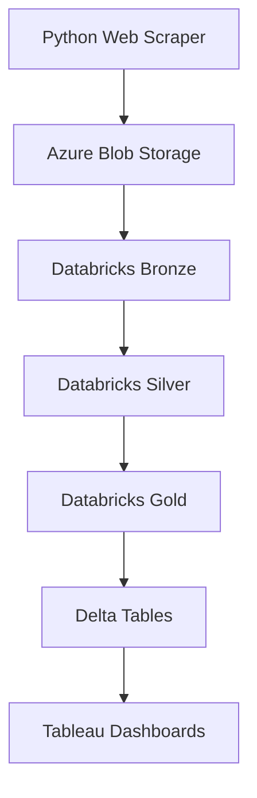

# 🧠 Kabum Notebook Market Analytics Pipeline
# 🧠 Pipeline de Análise do Mercado de Notebooks da Kabum


---

# 🇺🇸 English

End-to-end **Data Engineering pipeline** that collects notebook market data from the web and transforms it into analytical insights.

Technologies used:

- Python Web Scraping
- Azure Blob Storage (Data Lake)
- Databricks + PySpark
- Delta Lake
- Tableau Dashboards

📸 **(insert screenshot here: project overview / architecture)**

---

# Architecture Overview

The project follows the **Medallion Architecture pattern**:

Bronze → Silver → Gold

- Bronze → raw scraped data  
- Silver → cleaned and structured data  
- Gold → analytical datasets used by dashboards  

---

# Architecture Diagram



---

# Azure Infrastructure

Azure Blob Storage is used as the **Data Lake layer**.

📸 **(insert screenshot here: Azure Storage Account Overview)**

📸 **(insert screenshot here: containers bronze / silver / gold)**

📸 **(insert screenshot here: folder structure inside bronze container)**

---

# Web Scraping

The project collects notebook data directly from KaBuM.

Libraries used:

- requests
- BeautifulSoup

Example:

```python
import requests
from bs4 import BeautifulSoup

def scrape_product(url):
    r = requests.get(url)
    soup = BeautifulSoup(r.text, "html.parser")

    name = soup.find("h1").text
    price = soup.find("span").text

    return {
        "product_name": name,
        "price": price
    }
```

📄 **(insert script here: kabum_scrape_v2.py)**

📄 **(insert script here: run_local.py)**

---

# Databricks Pipeline

The pipeline runs in Databricks using PySpark notebooks.

📸 **(insert screenshot here: Databricks workspace)**

📸 **(insert screenshot here: scripts in workspace)**

Pipeline notebooks:

📓 **(insert notebook here: 00_config_uc.ipynb)**  
📓 **(insert notebook here: 01_bronze_kabum_uc_adls_jsonl.ipynb)**  
📓 **(insert notebook here: 02_silver_transform_uc.ipynb)**  
📓 **(insert notebook here: 03_gold_enrichment_uc.ipynb)**  
📓 **(insert notebook here: 04_gold_scoring_quality_uc.ipynb)**  
📓 **(insert notebook here: 05_dashboard_sql_kpis_uc.ipynb)**  

---

# Bronze Layer

Stores raw JSON data scraped from the website.

---

# Silver Layer

Responsible for cleaning and structuring the dataset.

Example transformation:

```python
df_clean = df_raw \
    .withColumn("price", F.col("price").cast("double")) \
    .dropDuplicates(["product_key"])
```

---

# Gold Layer

Produces analytical datasets used by dashboards.

📸 **(insert screenshot here: gold table schema)**

---

# Data Quality Monitoring

Example:

```python
df_quality = df_gold.withColumn(
    "quality_score",
    F.when(F.col("price").isNull(), 0).otherwise(1)
)
```

📸 **(insert screenshot here: Databricks job running)**

---

# Dashboards

Two dashboards were built using Tableau.

📸 **(insert screenshot here: Market Overview dashboard)**

📸 **(insert screenshot here: Data Quality dashboard)**

---

# Data Dictionary

Final analytical table:

notebooks_features_scored

| Column | Type | Description |
|------|------|-------------|
product_key | string | Unique product identifier |
ingestion_date | date | Data ingestion date |
marketplace | string | Data source |
search_term | string | Scraping search term |
product_name | string | Product name |
brand | string | Brand name |
price | double | Current price |
old_price | double | Previous price |
discount_pct | int | Discount percentage |
rating | double | Average rating |
reviews_count | bigint | Number of reviews |

📸 **(insert screenshot here: Databricks table view)**

---

# 🇧🇷 Português

Pipeline completo de **Engenharia de Dados** que coleta dados de notebooks da web e os transforma em insights analíticos.

Tecnologias utilizadas:

- Web Scraping com Python
- Azure Blob Storage (Data Lake)
- Databricks + PySpark
- Delta Lake
- Dashboards no Tableau

📸 **(colocar print aqui: visão geral do projeto / arquitetura)**

---

# Visão Geral da Arquitetura

O projeto segue o padrão **Medallion Architecture**:

Bronze → Silver → Gold

- Bronze → dados brutos do scraping  
- Silver → dados limpos e estruturados  
- Gold → datasets analíticos utilizados pelos dashboards  

---

# Infraestrutura Azure

O Azure Blob Storage é utilizado como **Data Lake**.

📸 **(colocar print aqui: Storage Account do Azure)**

📸 **(colocar print aqui: containers bronze / silver / gold)**

📸 **(colocar print aqui: estrutura de pastas no container bronze)**

---

# Web Scraping

Os dados são coletados diretamente do site da Kabum.

Bibliotecas utilizadas:

- requests
- BeautifulSoup

📄 **(colocar script aqui: kabum_scrape_v2.py)**

📄 **(colocar script aqui: run_local.py)**

---

# Pipeline no Databricks

O processamento de dados é executado no Databricks utilizando notebooks PySpark.

📸 **(colocar print aqui: workspace do Databricks)**

📸 **(colocar print aqui: scripts Python no workspace)**

Notebooks do pipeline:

📓 **(colocar notebook aqui: 00_config_uc.ipynb)**  
📓 **(colocar notebook aqui: 01_bronze_kabum_uc_adls_jsonl.ipynb)**  
📓 **(colocar notebook aqui: 02_silver_transform_uc.ipynb)**  
📓 **(colocar notebook aqui: 03_gold_enrichment_uc.ipynb)**  
📓 **(colocar notebook aqui: 04_gold_scoring_quality_uc.ipynb)**  
📓 **(colocar notebook aqui: 05_dashboard_sql_kpis_uc.ipynb)**  

---

# Camadas do Data Lake

## Bronze
Armazena os dados brutos coletados pelo scraper.

## Silver
Realiza limpeza e padronização dos dados.

## Gold
Produz tabelas analíticas utilizadas pelos dashboards.

📸 **(colocar print aqui: schema da tabela gold)**

---

# Monitoramento de Qualidade de Dados

O projeto inclui um sistema de **data quality score**.

📸 **(colocar print aqui: job do Databricks executando pipeline)**

---

# Dashboards

Dois dashboards foram desenvolvidos no Tableau.

📸 **(colocar print aqui: dashboard Market Overview)**

📸 **(colocar print aqui: dashboard Data Quality)**

---

# Dicionário de Dados

Tabela analítica final:

notebooks_features_scored

| Coluna | Tipo | Descrição |
|------|------|-------------|
product_key | string | Identificador único do produto |
ingestion_date | date | Data de ingestão |
marketplace | string | Origem do dado |
search_term | string | Termo de busca utilizado |
product_name | string | Nome do produto |
brand | string | Marca |
price | double | Preço atual |
old_price | double | Preço anterior |
discount_pct | int | Percentual de desconto |
rating | double | Avaliação média |
reviews_count | bigint | Número de avaliações |

📸 **(colocar print aqui: visualização da tabela no Databricks)**

---

# Autor

Filipe Albuquerque

Data Engineering • Analytics • Cloud Data Platforms
