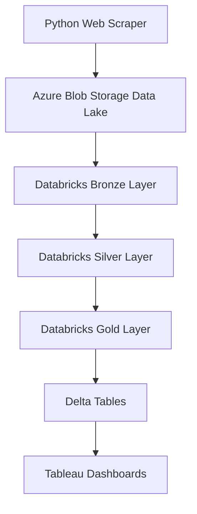

# 🧠 Pipeline de Engenharia de Dados – Mercado de Notebooks Kabum


---

# Visão Geral

Este projeto implementa um **pipeline completo de Engenharia de Dados** que coleta dados de notebooks do site da KaBuM e os transforma em insights analíticos.

Tecnologias utilizadas:

- Python Web Scraping
- Azure Data Lake (Blob Storage)
- Databricks + PySpark
- Delta Lake
- Monitoramento de Qualidade de Dados
- Dashboards no Tableau

---

# Arquitetura

O pipeline segue o padrão **Medallion Architecture**:

Bronze → Silver → Gold

Benefícios:

- rastreabilidade de dados
- pipelines reproduzíveis
- isolamento das transformações
- facilidade de debugging

---

# Diagrama de Arquitetura



---

# Camadas do Data Lake

## Bronze — Ingestão de Dados Brutos

Armazena **dados brutos coletados pelo scraper sem transformações**.

Características:

- ingestão JSONL
- ingestão incremental por `ingestion_date`
- particionamento por `search_term`
- payload bruto preservado para auditoria

Exemplo:

```python
df_raw = spark.read.json(bronze_path)
```

Notebook responsável:

📓 [01_bronze_kabum_uc_adls_jsonl.ipynb](notebooks/01_bronze_kabum_uc_adls_jsonl.ipynb)

📸 

---

## Silver — Limpeza e Padronização

Executa **limpeza e padronização do dataset**.

Transformações:

- type casting
- remoção de duplicatas
- tratamento de valores nulos
- normalização de marcas

Exemplo:

```python
df_clean = df_raw .withColumn("price", F.col("price").cast("double")) .withColumn("brand", F.upper(F.col("brand"))) .dropDuplicates(["product_key"])
```

Notebook responsável:

📓 [02_silver_transform_uc.ipynb](02_silver_transform_uc.ipynb)

📸 

---

## Gold — Feature Engineering e Analytics

Produz **datasets analíticos prontos para BI**.

Exemplo de extração de feature:

```python
ram_gb = F.regexp_extract(F.col("product_name"), r"(\d+)GB RAM", 1)
```

Exemplo de qualidade de dados:

```python
df_quality = df_gold.withColumn(
    "quality_score",
    F.when(F.col("price").isNull(), 0).otherwise(1)
)
```

Tabela final:

notebooks_features_scored

Notebooks responsáveis:

📓 [03_gold_enrichment_uc.ipynb](03_gold_enrichment_uc.ipynb)
📓 [04_gold_scoring_quality_uc.ipynb](04_gold_scoring_quality_uc.ipynb)
📓 [05_dashboard_sql_kpis_uc.ipynb](05_dashboard_sql_kpis_uc.ipynb)

📸 

---

# Web Scraping

Os dados são coletados diretamente do site da KaBuM.

Bibliotecas:

- requests
- BeautifulSoup

Exemplo:

```python
def scrape_product(url):
    r = requests.get(url)
    soup = BeautifulSoup(r.text, "html.parser")

    name = soup.find("h1").text
    price = soup.find("span").text

    return {
        "product_name": name,
        "price": price
    }
```

📄 [scraper/kabum_scrape_v2.py](scraper/kabum_scrape_v2.py)
📄 [scraper/run_local.py](scraper/run_local.py)

---

# Dashboards

Dois dashboards foram criados no Tableau.

📸 

📸 

---

# Dicionário de Dados

Tabela final:

notebooks_features_scored

| Coluna | Tipo | Descrição |
|------|------|-------------|
product_key | string | Identificador único |
ingestion_date | date | Data de ingestão |
marketplace | string | Origem |
search_term | string | Termo de busca |
product_name | string | Nome do produto |
brand | string | Marca |
price | double | Preço |
old_price | double | Preço anterior |
discount_pct | int | Percentual de desconto |
rating | double | Avaliação média |
reviews_count | bigint | Número de avaliações |


---

# 🧠 Kabum Notebook Market Analytics Pipeline

---

# Project Overview

This project implements a **complete end‑to‑end Data Engineering pipeline** that collects notebook market data from the KaBuM website and transforms it into analytical insights.

Technologies:

- Python Web Scraping
- Azure Data Lake (Blob Storage)
- Databricks + PySpark
- Delta Lake
- Data Quality Monitoring
- Tableau Dashboards

---

# Architecture

The pipeline follows the **Medallion Architecture pattern**:

Bronze → Silver → Gold

Benefits:

- data traceability
- reproducible pipelines
- transformation isolation
- easier debugging

---

# Architecture Diagram


---

# Data Lake Layers

## Bronze Layer — Raw Data Ingestion

Stores **raw data collected by the scraper without transformations**.

Example:

```python
df_raw = spark.read.json(bronze_path)
```

Notebook:

📓 [01_bronze_kabum_uc_adls_jsonl.ipynb](notebooks/01_bronze_kabum_uc_adls_jsonl.ipynb)

📸 

---

## Silver Layer — Data Cleaning

Responsible for **cleaning and standardizing the dataset**.

```python
df_clean = df_raw .withColumn("price", F.col("price").cast("double")) .withColumn("brand", F.upper(F.col("brand"))) .dropDuplicates(["product_key"])
```

Notebook:

📓 [02_silver_transform_uc.ipynb](02_silver_transform_uc.ipynb)

📸 

---

## Gold Layer — Analytics

Produces datasets ready for BI tools.

```python
ram_gb = F.regexp_extract(F.col("product_name"), r"(\d+)GB RAM", 1)
```

Final table:

notebooks_features_scored

Notebooks:

📓 [03_gold_enrichment_uc.ipynb](03_gold_enrichment_uc.ipynb)
📓 [04_gold_scoring_quality_uc.ipynb](04_gold_scoring_quality_uc.ipynb)
📓 [05_dashboard_sql_kpis_uc.ipynb](05_dashboard_sql_kpis_uc.ipynb)

📸 

---

# Web Scraping

The scraper collects notebook data directly from KaBuM.

Libraries:

- requests
- BeautifulSoup

```python
def scrape_product(url):
    r = requests.get(url)
    soup = BeautifulSoup(r.text, "html.parser")
```

📄 [scraper/kabum_scrape_v2.py](scraper/kabum_scrape_v2.py)
📄 [scraper/run_local.py](scraper/run_local.py)

---

# Dashboards

📸 

📸 

---

# Data Dictionary

Final table:

notebooks_features_scored

| Column | Type | Description |
|------|------|-------------|
product_key | string | Unique identifier |
ingestion_date | date | Ingestion date |
marketplace | string | Source |
search_term | string | Search term |
product_name | string | Product name |
brand | string | Brand |
price | double | Current price |
old_price | double | Previous price |
discount_pct | int | Discount percentage |
rating | double | Average rating |
reviews_count | bigint | Number of reviews |

---

# Author

Filipe Albuquerque  
Data Engineering • Analytics • Cloud Data Platforms
